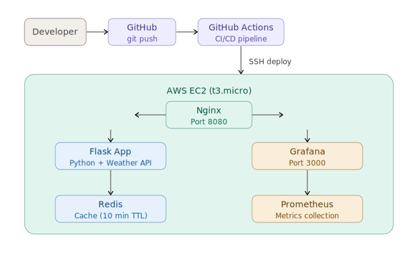

# 🌤️ Weather Dashboard

A production-ready weather dashboard built with Python Flask, Redis, Docker, and deployed on AWS EC2 with full CI/CD pipeline and monitoring stack.

## 🚀 Live Demo
- **Weather App:** http://32.199.246.159:8080
- **Grafana Monitoring:** http://32.199.246.159:3000
## 🛠️ Tech Stack
- **Backend:** Python Flask
- **Cache:** Redis
- **Containerization:** Docker & Docker Compose
- **Web Server:** Nginx (Reverse Proxy)
- **CI/CD:** GitHub Actions
- **Monitoring:** Grafana + Prometheus
- **Cloud:** AWS EC2 (t3.micro)
- **Networking:** AWS Elastic IP, Security Groups

## ✨ Features
- Real-time weather data via OpenWeatherMap API
- 5-day weather forecast
- Temperature trend graph (Chart.js)
- Dark/Light mode toggle
- Humidity, wind speed, pressure, visibility
- Redis caching (10 min TTL)
- Mobile responsive design

## 📊 Monitoring
- Prometheus metrics collection
- Grafana dashboard for service uptime
- Real-time monitoring of Flask app and Redis

## 🔄 CI/CD Pipeline
Automatic deployment on every push to `main` branch:
1. GitHub Actions triggered
2. SSH into AWS EC2
3. Pull latest code
4. Rebuild Docker containers


## 🏗️ System Architecture


## 🚀 Local Setup
```bash
git clone https://github.com/5678195/Weather-dashboard.git
cd Weather-dashboard
docker compose up -d
```

Visit: `http://localhost:5000`
